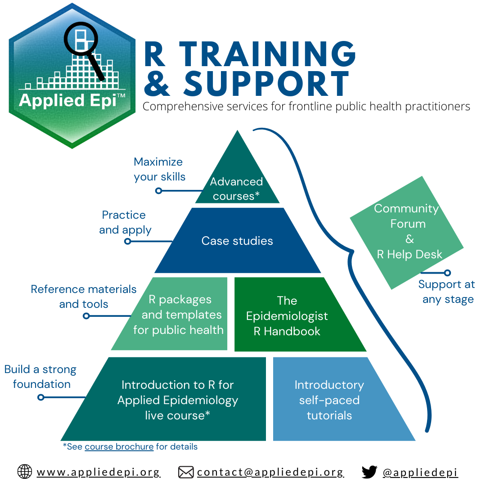

```{r, eval=F, echo=F, include = F}
# Must do in order to render.

pacman::p_load(xaringan) # the core package
devtools::install_github("gadenbuie/xaringanExtra") # useful extras
devtools::install_github("gadenbuie/countdown") # to add a countdown timer
remotes::install_github("mitchelloharawild/icons") # to have icons
icons::download_fontawesome() # fonts

# Render the slides in RStudio viewer by running the command xaringan::infinite_moon_reader()

# Slides will appear in viewer, and will update as you edit/save
```


```{r setup, include=FALSE}
knitr::opts_chunk$set(echo = FALSE, 
                      warning = FALSE, 
                      message = FALSE, 
                      fig.retina = 3  ## retina more effective than w/h (according to twitter)
                      # fig.width = 16, 
                      # fig.height = 10
                      )
## background images
options(htmltools.dir.version = FALSE)

## install and load necessary packages 
pacman::p_load(
  rio,        # importing data  
  here,       # relative file pathways  
  janitor,    # data cleaning and tables
  lubridate,  # working with dates
  tidyverse,  # data management and visualization
  gtsummary,  # summary tables
  flair,      # coloring text
  kableExtra, # for output tables
  flextable,  # for some tables and styling
  xaringanthemer,  # for styling presentation 
  countdown
)

```


```{r  xaringan-themer, include = FALSE}

## define presentation colours (theme) using {xaringanthemer} package 
## https://pkg.garrickadenbuie.com/xaringanthemer/articles/xaringanthemer.html

## nice colours: 
  ## purple: "#440154FF"
  ## blue: "#39568CFF"
  ## green: "#1F968BFF"

## see ?style_mono_accent for all the things can customise
style_mono_accent(
  base_color = "#440154FF", 
  link_color = "#39568CFF", 
  # add logo to the title page
  # title_slide_background_image = here::here("slides", "images", "template", "your_logo.png"),
  title_slide_background_position = "95% 95%",
  title_slide_background_size = "25%",
  ## add logo to all following slides
  # background_image = here::here("slides", "images", "template", "your_logo.png"), 
  background_size = "10%",
  background_position = "100% 0%"
)
```

```{css, echo=F}
    .remark-slide table{
      border: none
    }
    .remark-slide-table {
      
    }
    tr:first-child {
      border-top: none;
  }
    tr:last-child {
    border-bottom: none;
  }
  
.center2 {
  margin: 0;
  position: absolute;
  top: 50%;
  left: 50%;
}
```


```{css, echo = F}
/* THIS IS A CSS CHUNK - THIS IS A COMMENT */
/* Size of font in code echo. E.g. 10px or 50% */
.remark-code {
  font-size: 70%;
}
/* Size of font in text */
.medium-text {
  font-size: 75%;     
}
/* Size of font in tables */
.small-table table {
  font-size: 6px;     
}
.medium-table table {
  font-size: 8px;     
}
.medium-large-table table {
  font-size: 10px;     
}
```

```{r, echo=F, eval=T}
linelist <- rio::import(here::here("data", "clean", "linelist_combined_20141201.rds"))
```

# Slide title  

This template was designed by the team at [Applied Epi](www.appliedepi.org). It was build using inputs from [this tutorial](https://pkg.garrickadenbuie.com/xaringanthemer/articles/xaringanthemer.html) and [this tutorial](https://slides.yihui.org/xaringan/#1).  

**Bold text** *italic text*  

```{r, eval = TRUE, echo = FALSE, out.width = "50%"}
# Using here() alone won't work because Rmd folder becomes the rendering root.
# adding xfun::relative_path() creates a dynamic file path between the Rmd location and the here() path. It dynamically creates the ../../etc filepath.


```


???
Presenter notes here 


---
# A bright future

- How many hours have you spent updating slides?

- Once you have written the code once, there is no need to point and click and re-do slides with updated data! This is great news!  


```{r, eval = TRUE, echo = FALSE, out.width = "100%"}

```

???
Presenter notes here


---
# Title 
## Subtitle

.pull-left[
- Bullet  
  - Sub-bullet  
  - Sub-bullet  
- Bullet  
  - Sub-bullet  
  - Sub-bullet
]

.pull-right[

```{r, eval = TRUE, echo = FALSE, out.width = "100%"}

```

]

.footnote[
A footnote is here.
]


???
- Presenter notes
- Presenter notes
- Presenter **notes**


---
# Slide with a static R table

```{r, echo=FALSE, warning=F, message=F}
table <- dplyr::tribble(
  ~Row, ~Text,
  "1",   str_glue("text"),
  "2",   str_glue("text"),
  "3",   str_glue("text"),
  "4",   str_glue("text"),
  "5",   str_glue("text")
  )

table %>% 
  flextable::qflextable()
```


---
# Text on the left, image on the right

.pull-left[
## Easy (once you learn the syntax!)  

We know that R can be scary (it was for us too when we first learned it!), but once you learn the basics, and how to apply these to statistics within R, you can very quickly produce in depth analysis of data in an efficient, effective and reproducible way! 
]

.pull-right[

```{r, eval = TRUE, echo = FALSE, out.width = "100%"}

```
```
]


---

# Slide title 

Some code is run but not shown  
Other code is run and shown .

```{r, echo=F}
demo <- linelist %>% 
     head(5) %>% 
     select(case_id, age, gender, lab_confirmed, fever, epilink)
```

```{r, eval=T}
demo %>% 
  knitr::kable()
     
```

--

More text here


---
# Slide with clickable timer

```{r}
countdown(minutes = 5, seconds = 00)
```


---
# Incremental appearance text

Starter text


--

Normal text

1) A number text

--

2) A number text

--

3) A number text

--

4) A number text

--

5) A number text

--

And in summary, the slide is done


???
Notes for presenter


---

class: medium-large-table

# Scrollable data frame  

This uses class: medium-large-table  
  

```{r}
head(linelist, 25) %>% 
  tibble() %>% 
  DT::datatable(
    options = list(
      scrollY = 300,
      scrollX = 600,
      pageLength = 25,
      fontSize = '25%',
      dom = "ti",
      ordering = FALSE,
      rownames = FALSE,
      options = list(pageLength = 5, scrollX=T),
      class = 'white-space: nowrap' 
    )
  )
```

???
Table shows just the first 25 rows, to load faster.  


---

# Show a small dataset  

Here we use just the first 5 rows and a few columns:  

```{r, echo=F}
demo <- linelist %>% 
     head(5) %>% 
     select(case_id, age, gender, lab_confirmed, date_onset, wt_kg, ht_cm)

```

```{r, eval=T}
demo %>% 
  knitr::kable()
     
```

--

Some text


---
# Emphasis bold in code

You can write R code this way

`filter(`**demo**`, age < 18)`


Or you can write it this way  

**demo** `%>% filter(age < 18)`


```{r, eval=T, echo=F}
demo %>% filter(age < 18) %>% select(case_id, age, gender) %>% knitr::kable()
```


---
# Combine multiple plots

.pull-left[

A static table  

Text   |Text
-------|------------------
Text|More text  
Text|More text

.footnote[A footnote]  

]

.pull-right[

```{r, message=F, warning=F}
# Histogram
histogram <- ggplot(
    data = linelist,
    mapping = aes(
      x = date_onset))+
  geom_histogram(fill = "darkorange")+
  labs(title = "geom_histogram()")+
  theme_minimal(base_size = 16)
  

points <- ggplot(
    data = linelist,
    mapping = aes(
      x = age_years,       
      y = ht_cm)
    )+
  geom_point()+
  labs(title = "geom_point()")+
  theme_minimal(base_size = 16)

# combine pre-defined plots in a grid
cowplot::plot_grid(histogram, points,
                  nrow = 2,
                  rel_widths = c(2,2)
                  )
```

]


---

class: large-table

# Class: large-table

Text

Text|Text
-------------------------------------------------------------------|--------------------------------------------------------------------
`shape`      |Text
`fill`       |Text
`color`      |Text
`size`       |Text
`alpha`      |Text
`width`      |Text
`linetype`   |Text
`binwidth`   |Text
  


???
Notes


---
class: medium-text

# Class: medium-text


.pull-left[

Text

* Text
  - Text
  - Text

</br>
</br>
</br>
</br>


]


.pull-right[

Text

```{r, eval = T, message=F, warning=F}

color_purple <- ggplot(data = linelist, aes(x = age_years, y = ht_cm))+
  geom_point(color = "purple")+
  theme_minimal(base_size = 16)+
  labs(title = "Using color = 'purple'")

color_hospital <- ggplot() + theme_void()

cowplot::plot_grid(color_purple, color_hospital,
                  nrow = 2, rel_widths = c(2,2))


```
]


---
# Learning curve 

R has become easier to learn in the last 5 years

.pull-left[
- Friendlier user interface (RStudio)
- Simpler syntax ("tidyverse")
- Free resources & interactive tutorials available  
    - **Epidemiologist R Handbook**
    - **R 4 Data Science**
    - **R epidemiology case studies**
]

.pull-right[

```{r difficulty_plot, warning = FALSE, message = FALSE}
exp <- function(x){x^2}
lgr <- function(x){log(x) + 4}
num <- 10000
linwid <- 2
ggplot() + 
  geom_function(fun = exp,
                n = num, 
                linewidth = linwid,
                aes(colour = "Excel")) +
  geom_function(fun = lgr, 
                n = num, 
                linewidth = linwid,
                aes(colour = "R")) + 
  scale_y_continuous(expand = c(0, 0), 
                     limits = c(0, 10)) + 
  scale_x_continuous(expand = c(0, 0), 
                     limits = c(0, 5)) + 
  labs(x = "Code complexity", 
       y = "Task difficulty") + 
  theme_classic(base_size = 24) + 
  theme(axis.text = element_blank(),
        axis.ticks = element_blank(), 
        legend.position = "bottom", 
        legend.title = element_blank())
```

]

???
Presenter notes


---

# 2-table layout  


```{r include=FALSE, echo=F}
patients <- tribble(
     ~case_id, ~age, ~age_unit, ~gender,
     "5fe599", 2, "years", "m",
     "8689b7", 3, "years", "f",
     "11f8ea", 56, "years", "m",
     "b8812a", 18, "years", "f",
     "893f25", 3, "years", "m")


hosp <- tribble(
     ~id_patient, ~outcome,
      "5fe599", "Died",
      "8689b7", "Recovered",
      "11f8ea", "Recovered",
      "ebd24z", "Died")
```


.pull-left[

Text  

```{r include=TRUE, echo=FALSE}
patients %>% 
     qflextable() %>% 
     bg(part = "header", i = 1, j = 1, bg = "yellow")
```


]

.pull-right[

Text  

```{r include=TRUE, echo=FALSE}
hosp %>% 
     qflextable() %>% 
     bg(part = "header", i = 1, j = 1, bg = "yellow")
```

]

<br>

Text


???
Presenter notes


---

### 4 quad layout
.pull-left[
```{r eval = TRUE, echo=FALSE}
patients %>% 
     qflextable() %>% 
     bg(part = "body", i = 1, j = 1:4, bg = "orange")
```
]
.pull-right[
```{r eval = TRUE, echo=FALSE}

hosp_dup <- tribble(
     ~id_patient, ~outcome,
      "5fe599", "Died",
      "5fe599", "Alive",
      "8689b7", "Recovered",
      "11f8ea", "Recovered",
      "ebd24z", "Died")

hosp_dup %>%
    qflextable() %>% 
     bg(part = "body", i = 1:2, j = 1:2, bg = "orange")
```
]
.pull-left[
```{r eval=FALSE, echo=TRUE}
# code!
left_join(patients, hosp,
  by = c(
   "case_id" = "id_patient"))
```

]
.pull-right[
```{r eval=TRUE, echo=FALSE}
left_join(patients,
          hosp_dup,
  by = c("case_id" = "id_patient")) %>% 
  qflextable() %>% 
  bg(part = "body", i = 1:2, j = 1:5, bg = "orange")
```
]


---
# Gif embed  

.pull-left[

* Text  

* Text  

* Text  

* Text  

]


.pull-right[

```{r eval = TRUE, echo=FALSE, out.width = '100%'}
knitr::include_graphics("slides_images/right-join.gif")
```


]


---
# Show YAML or other 'asis'  

Text here

```{results='asis'}
---
title: "R is great for public health"
subtitle: "A personal testimony"
author: "Me"
date: "2022-03-15"
output: 
  html_document
---
```

???
Note that it starts and ends with three dashes, and that placement of spaces and colons are very important  


---
# Static tables

Text

Column 1 |Column  2 |Column 3
---------|----------|--------
Cell A   |Cell B    |Cell C
Cell D   |Cell E    |Cell F


---

# Ready to try it out?

Any questions?

---


---
class: inverse, center, middle

## Thank you! 


```{r, eval = TRUE, echo = FALSE, out.width = "75%"}

```

